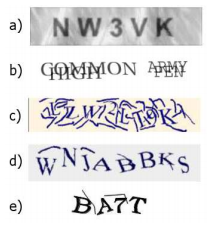

# 前言

当今人们越来越依赖Web服务，如查看E-mail，淘宝购物，百度搜索，这些Web服务已经和我们息息相关，我们很难想象没有他们的生活。而对于这些服务的提供者来说，确保服务资源能真正被用户使用，而不是被恶意机器人使用，是至关重要的。如使用机器人注册账户[@baird2002human]，不仅会占用宝贵服务器资源，还为发布恶意信息埋下伏笔。所以区分访问来自人类还是机器人是十分重要的，验证码正是因为这个原因而被广泛使用。验证码（CAPTCHA）是“Completely Automated Public Tests to tell Computers and Humans Apart”[@baird2002human;@chellapilla2005designing;@rui2003excuse;@von2003captcha;@von2004telling]。的缩写。其主要思想是通过电脑向人类提问，通过回答来区分人和机器人。这个问题需要对人来说简单，而对电脑来说很难（或是需要很长时间）解决。

# 背景

目前在互联网上最流行的CAPTCHA系统，是基于文本的。但是，由于计算机视觉技术的提高，基于文本的系统很容易被攻击成功[@yan2008low;@mori2003recognizing;@simard2005using]。所以越来越多的研究者考虑如何替换掉基于文本的系统，于是有基于图像的[@elson2007asirra;@gossweiler2009s;@chew2004image;@datta2005imagination;@matthews2010scene;@zhu2010attacks]和基于声音的[@chan2003using;@bigham2009evaluating]系统。

## 文本验证码系统

总的来说，基于文本的验证码系统让用户识别字母或数字，GIMPY是一个经典的例子[@gimpy]。攻击基于文本的使用大多使用OCR(optical character recognition)。这个技术讲图片分割成晓得区域，每个区域只有一个字母，然后使用模式识别技术使用字母模板匹配每一个区块[@mori2003recognizing;@yan2008low;@simard2005using]。最后一步是一个比较成熟的AI问题。为了防止这样的攻击，基于文本的系统使用如下技术来增强鲁棒性[@el2010robustness;@chellapilla2005designing]：

- 增加噪音：向图片中增加线和点，来干扰区域分割算法。
- 字符扭曲：对字符使用扭曲变换，或3D变换来增加文字识别难度。
- 字符连接或重叠：将两个或者多个字母连接或者重叠起来，使得攻击算法无法正确划分图片。

{#fig:text-captcha}

如 @fig:text-captcha ，a很容易被OCR破解，b引入了字符的重叠，c引入了噪声，d和e同时引入噪声和字符扭曲。

然而，以上方法在提高系统鲁棒性的同时，也提高了人类识别的难度，特别是字符的连接。如字符“r”和“n”连接起来，看起来就像是字符“m”。字符扭曲也有可能增加用户识别的难度，如扭曲的后的”S“和”5“就很难分辨。还有些系统使用不同的颜色来标示每个字符，而这些都能很容易的被自动化的程序所移除，并没有给机器识别带来任何的难度[@yan2008usability]。而reCAPTCHA[@googlerecaptcha]提供了一种比较好的解决思路：使用两个单词来验证用户，其中一个是确定答案的，另外一个是不确定的。不确定答案的单词来自古籍中无法被自动化OCR程序识别的单词，确定答案的单词是机器生成的或者多个用户的答案是一致的来自古籍中的单词。这个过程既可以起到验证作用又可以数字化图书，是一个非常好的解决方案。但是还是这个解决方案还是有如下缺点：

- 对移动用户不友好：移动设备通常屏幕较小，输入困难，输入较长的单词对用户来说是一个极大的负担。
- 无法防御基于机器学习的攻击：基于机器学习的攻击，能比较容易的识别文本，此方法对与基于机器学习的攻击没有很好的鲁棒性。
- 易导致用户多次刷新：由于一个单词来自古籍，可能出现用户多次刷新来获得清晰可读的验证码，而这对热门Web服务器来说，是一个极大的负担。

正是由于基于文本的系统固有的缺点，有了声音验证系统和图像验证码系统。

## 声音验证码系统

声音验证码系统弥补来了视觉障碍用户的可用性需求。一般的声音验证码系统让字母和数字被随机的声音间隔隔开，并向其中添加背景噪声。用户只有很少的时间去确定每个单词。某种意义上说，声音验证码系统仅仅是文本验证码系统的听觉版本，用声音替代可视化的东西，并没有明显的增加破解的难度。构成攻击的基础是相似的——特征提取和字符分类。对机器和人的难度曲线是相似的[@bursztein2011failure]。所以声音验证码系统既没有提供更加用户友好的接口，也没有更好的防范自动化程序的破解。这也就是它没有被广泛使用的根本原因。

## 图像验证码系统

图像验证码系统逐渐替代了越来越复杂的文本验证码系统，图像验证码有很好的用户接口，它主要利用人类对图片超乎想象的处理能力来区分人和机器。ESP-PIX[@esp-pix]让用户从一系列词中选择能描述素有图片的。SQ-PIX[@sq-pix]让用户标示出物品的所在位置，这对图片候选库提出很大要求，大部分图片可能需要人工处理。Google的图片验证码“what's up”[@gossweiler2009s]让用户旋转图片，把图片旋转至正确方向。这个过程需要比较精确的鼠标移动，并且有些图片的方向可能是模棱两可的。Microsoft的Asirra[@elson2007asirra]使用petfinder.com上已有的数据库，让用户在12张图片中找到所有有猫的图片（其他图片都为狗）。而这些图片可能是模棱两可的，如 @fig:asirral 中，左图中既有猫也有狗，右图中有一只长得像狗一样的猫。这样的验证码这个对于机器来说，难度只有区分狗和猫，而对于人来说，却可能花费很长时间解决。

{#fig:asirral}

12306火车购票[@captcha12306]让用户从所有图片中选择系统指定内容的图片，如 @fig:12306captcha 。但是同样也存在一个致命的问题：图片需要人工导入，并手动指定标签。有如下缺点：

- 人工失误：人工指定标签时给出错误标签
- 易遭受穷举攻击：因为人工指定，图片库不可能太大，穷举所有图片，并自动或手动指定标签即可很好的破解此类验证码
- 手工录入的标签信息很难复用：花费大量人力物力输入的信息除了验证码，并不能用在其他地方。

{#fig:12306captcha}

正是由于图片验证码系统普遍有需要手动录入图片的缺点，本文提出了一种**图片数据库自动增长**的方案来解决这个问题。

# 自增长图片系统设计

不同于文本验证码系统，文本验证码系统可以生成问题图片，而图片验证码系统生成问题的过程很依赖图片数据库。这就决定图片数据库是图片验证码系统中至关重要的角色。图片数据库的的数据量大小和质量好坏，直接影响图片验证码系统的鲁棒性和用户友好性。数据量大能很好的避免穷举攻击，而数据质量高，能很好提升系统的用户友好性。如何提高图片数据库的数据量和数据质量，成了现在大多数验证码系统亟待解决的问题[@chew2004image]。本文创新性的提出了一种图片验证码系统图片数据库自增长策略，能很好的解决这个问题。同时，本系统在设计之初就考虑到图片数据库复用问题：利用海量数据，服务于图片语义化搜索。这使得本系统合理利用用户完成验证码过程中输入，为搜索引擎的图片语义化搜索做出贡献。

## 思路

reCAPTCHA系统是基于文本的验证码系统，是借助于人类大脑对难以识别的字符的辨别能力，进行对古旧书籍中难以被OCR识别的字符进行辨别的技术。这是一个很好的”增长“思路。本系统参考了reCAPTCHA系统，将其改进以适应图片验证码系统。

### reCAPTCHA系统

每次验证码会显示两个单词让人来识别，其中一个是需要用户识别的难认词，另外一个是答案已知的词。软件将能够正确识别答案已知词的用户看作是人类，当答案已知的词被正确识别出来后，程序会记录用户对无法阅读的词的回答并将其添加到它的数据库中。这样就完成了一次人工的OCR识别。为了改善软件的精确性， reCAPTCHA 会将最困难的词发送给多个用户并挑选其中有相同答案的作为正确的答案，确率能够达到99%。用户每使用一次这个程序，实际上就是在帮助数字重现古籍。这项技术已经被Google广泛使用。

reCAPTCHA系统提供了很好的利用用户输入来完成某种目的的思路。即利用用户对OCR无法识别单词的输入，完成古籍数字化工作。相思的思想可以用在图片验证码系统上吗？答案是肯定的。我们可以让**用户选择两种物体，其中一个的答案是确定的，起验证作用；另外答案一个是不确定的，起增长作用**。但是在实施的时候，任然需要对reCAPTCHA系统进行很多改进，才能使之很好的用在图片验证码系统上。

### 图片验证码的自学习与reCAPTCHA系统差异

图片验证码的自学习策略并不能直接把reCAPTCHA系统思路方案拿来使用，这由于图片验证码系统和文本验证码系统有着本质的区别：

- 验证问题生成：图片验证码依赖图像数据库，而reCAPTCHA系统一般是由系统随机选择一个单词，然后由系统生成一张包含单词图片交由用户识别。
- 用户输入类型：图片验证码一般是让用户点击选择图片，而reCAPTCHA系统是让用户输入图片中的文本。
- 图像分割：图片验证码需要预先将一张图片上物体分离出来，而reCAPTCHA系统只需要讲古籍上的单个字体提取出来，这个二者的难度完全不在一个量级。
- 预识别：图片验证码需要预先对图片加上描述标签，而reCAPTCHA系统并不需要任何预识别。

正是由于以上差异，图片验证码系统自学习系统要比reCAPTCHA复杂得多。其中特别是图像分割[@许新征2015图像分割的新理论和新方法;@林开颜2005彩色图像分割方法综述]和预识别[@]部分，涉及计算机视觉以及人工智能领域。

### 图片自学习策略

\begin{thebibliography}{99}

\end{thebibliography}